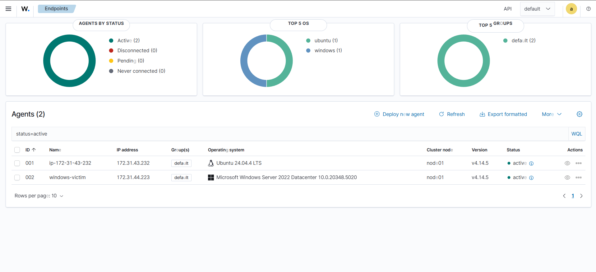

# SOC-Home-Lab-AWS-Wazuh
Laboratorio de detección de amenazas basado en AWS para demostrar  habilidades de SOC Analyst usando Wazuh SIEM y técnicas MITRE ATT&amp;CK.

## Objetivo
Laboratorio de detección de amenazas basado en AWS para demostrar 
habilidades de SOC Analyst usando Wazuh SIEM y técnicas MITRE ATT&CK.

## Arquitectura
- Wazuh Server: EC2 t3.small, Ubuntu 24.04, us-east-1
- Agente Linux víctima: EC2 t3.micro, Ubuntu 24.04 (Semana 2)
- Agente Windows víctima: EC2 t3.micro, Windows Server (Semana 2)
- Atacante: Kali Linux (local)

## Stack
- SIEM: Wazuh 4.9.2
- Simulación de ataques: Atomic Red Team + Kali Linux
- Framework: MITRE ATT&CK

## Estado del proyecto
- [x] Semana 1 — Infraestructura base y Wazuh desplegado
- [x] Semana 2 — Agentes conectados
- [x] Semana 3-5 — Detecciones MITRE ATT&CK
- [ ] Semana 6 — Documentación final

## Dashboard
.

## Tuning y Falsos Positivos

| Técnica | Regla | Falsos Positivos Encontrados | Decisión |
|---|---|---|---|
| T1110 Brute Force | 5720 | Ninguno en el lab | Regla default aceptable |
| T1053.005 Scheduled Task | 100002 | Ninguno fuera del ataque | Regla custom estable |
| T1078 Valid Accounts | 100004 | Ninguno fuera del ataque | Regla custom estable |
| T1059.001 PowerShell | 92213, 92057 | Ninguno fuera del ataque | Reglas default aceptables |

### Notas de tuning
- Las reglas custom 100002 y 100004 fueron escritas precisamente para 
  reducir falsos positivos — elevando severidad solo cuando hay contexto 
  de riesgo real (SYSTEM + nombre sospechoso, cuenta + privilegios elevados)
- En un entorno productivo real, se requeriría un período de observación 
  de 2-4 semanas para identificar patrones legítimos antes de activar 
  alertas de level 14
- La ausencia de falsos positivos en el lab se debe al entorno controlado — 
  no hay usuarios reales ni software de terceros generando ruido
  
## Cobertura MITRE ATT&CK

