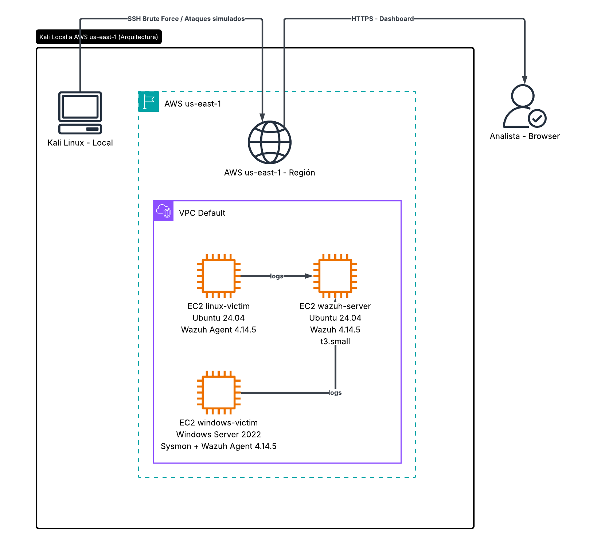
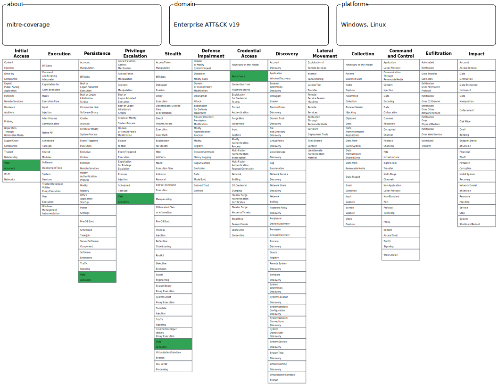

# SOC Home Lab — AWS + Wazuh

> Laboratorio de detección de amenazas construido sobre AWS, 
> usando Wazuh como SIEM y técnicas reales del framework MITRE ATT&CK.

---

## Objetivo
Materializar habilidades de SOC Analyst mediante la detección de 
técnicas de ataque simuladas en un entorno controlado, documentando 
cada detección como lo haría un analista en un entorno real.

---

## Arquitectura


| Componente | Tecnología | Specs |
|---|---|---|
| SIEM | Wazuh 4.14.5 | EC2 t3.small, Ubuntu 24.04, us-east-1 |
| Víctima Linux | Ubuntu 24.04 | EC2 t3.micro, Wazuh Agent |
| Víctima Windows | Windows Server 2022 | EC2 t3.micro, Sysmon + Wazuh Agent |
| Atacante | Kali Linux 2025.4 | VirtualBox local |
| Simulación | Atomic Red Team + Hydra | Técnicas MITRE ATT&CK |

---

## Cobertura MITRE ATT&CK


| Técnica | Táctica | OS | Detección | Regla Custom |
|---|---|---|---|---|
| T1110 Brute Force | Credential Access | Linux | Level 10 | No |
| T1053.005 Scheduled Task | Persistence | Windows | Level 14 | Sí |
| T1078 Valid Accounts | Persistence | Linux | Level 14 | Sí |
| T1059.001 PowerShell | Execution | Windows | Level 15 | No |

---

## Detecciones

Cada técnica tiene su propio write-up con ataque ejecutado, 
logs capturados, reglas disparadas y análisis de analista:

| # | Técnica | Write-up | Highlights |
|---|---|---|---|
| 1 | [T1110 — Brute Force](detections/T1110-brute-force.md) | 683 alertas, Hydra vs SSH | Detección out-of-the-box level 10 |
| 2 | [T1053.005 — Scheduled Task](detections/T1053-scheduled-task.md) | Regla custom 100002 | Escalado de level 3 a level 14 |
| 3 | [T1078 — Valid Accounts](detections/T1078-valid-accounts.md) | Regla custom 100004 | Backdoor con privilegios SYSTEM |
| 4 | [T1059.001 — PowerShell](detections/T1059-powershell.md) | Level 15 out-of-the-box | Base64 + evasión detectada |

---

## Reglas personalizadas

Dos técnicas requerían tuning activo — las reglas default eran 
insuficientes para generar respuesta en un SOC real:

```xml
<!-- T1053.005 — Scheduled Task con nombre sospechoso como SYSTEM -->
<rule id="100002" level="14">
  <if_sid>67014</if_sid>
  <field name="win.eventdata.taskName" type="pcre2">
    (?i)(update|helper|svc|service|windows)
  </field>
  <field name="win.eventdata.userContext">S-1-5-18</field>
  <description>T1053.005 - Scheduled Task con nombre sospechoso 
  creada como SYSTEM</description>
  <mitre>
    <id>T1053.005</id>
  </mitre>
</rule>

<!-- T1078 — Nueva cuenta con privilegios elevados -->
<rule id="100004" level="14">
  <if_sid>5901</if_sid>
  <match>sudo|wheel|admin</match>
  <description>T1078 - Nueva cuenta creada con privilegios 
  elevados: alta probabilidad de backdoor</description>
  <mitre>
    <id>T1078</id>
    <id>T1136.001</id>
  </mitre>
</rule>
```

---

## Tuning y Falsos Positivos

| Técnica | Regla | Falsos Positivos | Decisión |
|---|---|---|---|
| T1110 Brute Force | 5720 | Ninguno | Regla default aceptable |
| T1053.005 Scheduled Task | 100002 | Ninguno | Regla custom estable |
| T1078 Valid Accounts | 100004 | Ninguno | Regla custom estable |
| T1059.001 PowerShell | 92213, 92057 | Ninguno | Reglas default aceptables |

> En producción se requeriría un período de observación de 2-4 semanas 
> para identificar patrones legítimos antes de activar alertas de level 14.

---

## Hallazgos clave

1. **La cobertura de Wazuh no es uniforme** — técnicas de ejecución 
   visible (brute force, PowerShell) tienen detección madura. Técnicas 
   de persistencia silenciosa requieren tuning activo.

2. **Sysmon es crítico para Windows** — sin Sysmon, T1059.001 y 
   T1053.005 generarían evidencia mínima. La calidad del log depende 
   directamente de la configuración del agente.

3. **Level 3 no genera respuesta** — dos técnicas llegaron con 
   severidad insuficiente out-of-the-box. El trabajo del analista 
   no es solo detectar sino priorizar correctamente.

---

## Estado del proyecto
- [x] Semana 1 — Infraestructura base y Wazuh desplegado
- [x] Semana 2 — Agentes Linux y Windows conectados
- [x] Semana 3 — T1110 Brute Force (683 alertas, level 10)
- [x] Semana 4 — T1053.005 Scheduled Task (regla custom level 14)
- [x] Semana 4 — T1078 Valid Accounts (regla custom level 14)
- [x] Semana 5 — T1059.001 PowerShell (level 15 out-of-the-box)
- [x] Semana 6 — Documentación final y cobertura MITRE ATT&CK

---

## Estructura del repositorio
soc-home-lab/
├── README.md
├── infrastructure/
│   ├── architecture.png
│   └── mitre-coverage.svg
├── detections/
│   ├── T1110-brute-force.md
│   ├── T1053-scheduled-task.md
│   ├── T1078-valid-accounts.md
│   └── T1059-powershell.md
└── evidence/
├── T1110/
├── T1053/
├── T1078/
└── T1059/

---

## Autor
**Yober Rodríguez Alemán** — Ingeniero en Sistemas | Costa Rica  
Orientado a roles de SOC Analyst y Cybersecurity  
[LinkedIn](www.linkedin.com/in/yober-rodriguez-aleman)
