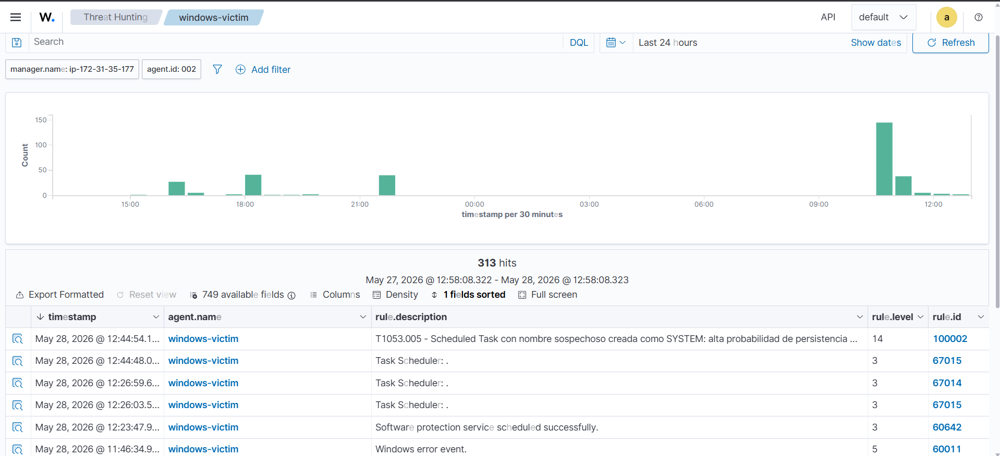
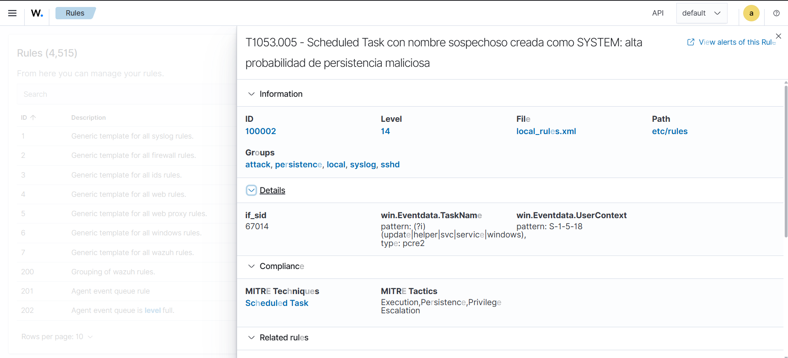
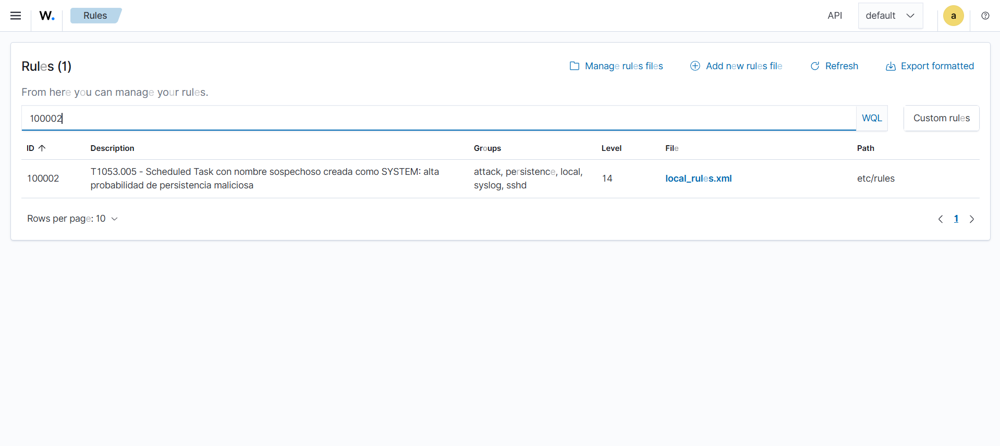

# T1053.005 — Scheduled Task (Persistence)

## Metadata
| Campo | Detalle |
|---|---|
| Técnica MITRE | T1053.005 - Scheduled Task/Job |
| Táctica | Execution, Persistence, Privilege Escalation |
| Fecha | 2026-05-28 |
| Agente objetivo | windows-victim (Windows Server 2022) |
| Herramienta de ataque | schtasks.exe (nativo de Windows) |

---

## Objetivo
Simular un atacante estableciendo persistencia en un endpoint Windows 
mediante una tarea programada maliciosa disfrazada con nombre legítimo, 
y validar que Wazuh la detecta con severidad apropiada.

---

## Entorno
- **Atacante:** Administrador local en windows-victim (simula post-compromise)
- **Víctima:** EC2 t3.micro, Windows Server 2022, Sysmon + agente Wazuh 4.14.5
- **SIEM:** Wazuh 4.14.5 en EC2 t3.small, us-east-1

---

## Descripción de la técnica
T1053.005 consiste en crear tareas programadas para ejecutar código 
malicioso automáticamente. Es una técnica de persistencia común porque:

- Sobrevive reinicios del sistema
- Puede ejecutarse como SYSTEM sin intervención del usuario
- Es fácil de camuflar con nombres que imitan procesos legítimos de Windows
- No requiere modificar el registro ni instalar servicios

En entornos reales, herramientas como Cobalt Strike y muchos RATs usan 
esta técnica para mantener acceso después de una intrusión inicial.

---

## Ejecución del ataque

**Comando ejecutado en windows-victim (PowerShell como Administrador):**

```powershell
schtasks /create /tn "WindowsUpdateHelper" /tr "powershell.exe -WindowStyle Hidden" /sc onlogon /ru System /f
```

**Análisis del comando:**
- `/tn "WindowsUpdateHelper"` — nombre diseñado para parecer legítimo
- `/tr "powershell.exe -WindowStyle Hidden"` — payload oculto
- `/sc onlogon` — se ejecuta en cada login
- `/ru System` — corre con privilegios SYSTEM
- `/f` — sobreescribe sin confirmación

---

## Evidencia — Logs capturados

Dos fuentes independientes registraron el ataque:

### TaskScheduler/Operational
| EventID | Descripción | Detalle |
|---|---|---|
| 106 | Tarea registrada | TaskName: `\WindowsUpdateHelper`, User: `S-1-5-18` (SYSTEM) |
| 140 | Tarea actualizada | TaskName: `\WindowsUpdateHelper` |
| 141 | Tarea eliminada | Registrado al limpiar el lab |

### Sysmon
| EventID | Descripción | Detalle |
|---|---|---|
| 1 | Process Create | `schtasks.exe /create` lanzado desde `powershell.exe`, IntegrityLevel: High |
| 11 | File Created | `C:\Windows\System32\Tasks\WindowsUpdateHelper`, RuleName: T1053 |

**Dato clave del Sysmon EventID 1:**
Image: C:\Windows\System32\schtasks.exe
ParentImage: C:\Windows\System32\WindowsPowerShell\v1.0\powershell.exe
CommandLine: schtasks.exe /create /tn WindowsUpdateHelper /tr
"powershell.exe -WindowStyle Hidden" /sc onlogon /ru System /f
IntegrityLevel: High
User: EC2AMAZ-JGH0V3J\Administrator

### Screenshots




---

## Análisis de detección

### Detección out-of-the-box — Insuficiente
Wazuh detectó la técnica con rule 67014 al nivel **3** — demasiado bajo 
para generar respuesta en un SOC real. La descripción genérica 
"Task Scheduler: ." no comunica el riesgo ni el contexto del evento.

### Problema identificado
La regla por defecto no considera:
- Que la tarea fue creada como `S-1-5-18` (SYSTEM)
- Que el nombre imita procesos legítimos de Windows
- La combinación de ambos factores como indicador de persistencia maliciosa

### Regla personalizada — Rule 100002
Se escribió una regla personalizada para elevar la severidad basándose 
en contexto real:

```xml
<rule id="100002" level="14">
  <if_sid>67014</if_sid>
  <field name="win.eventdata.taskName" type="pcre2">
    (?i)(update|helper|svc|service|windows)
  </field>
  <field name="win.eventdata.userContext">S-1-5-18</field>
  <description>T1053.005 - Scheduled Task con nombre sospechoso 
  creada como SYSTEM: alta probabilidad de persistencia maliciosa
  </description>
  <mitre>
    <id>T1053.005</id>
  </mitre>
  <group>attack,persistence</group>
</rule>
```

**Lógica de la regla:**
- Hereda de rule 67014 (TaskScheduler task registered)
- Filtra por `userContext: S-1-5-18` — solo dispara si corre como SYSTEM
- Regex detecta nombres que imitan procesos legítimos de Windows
- Level 14 — requiere respuesta inmediata

### Resultado
| Regla | Level | Descripción |
|---|---|---|
| 67014 (default) | 3 | Task Scheduler: . |
| 100002 (custom) | **14** | T1053.005 - Scheduled Task con nombre sospechoso creada como SYSTEM |

---

## ¿Qué haría un analista SOC Tier 1?

1. **Identificar la tarea** — nombre, trigger, payload, usuario que la creó
2. **Verificar legitimidad** — ¿existe `WindowsUpdateHelper` en el inventario de software aprobado?
3. **Revisar proceso padre** — `schtasks.exe` lanzado desde `powershell.exe` es sospechoso
4. **Buscar lateral movement** — ¿el mismo atacante creó tareas en otros endpoints?
5. **Contener** — deshabilitar la tarea, aislar el endpoint si se confirma compromiso
6. **Escalar a Tier 2** — level 14 requiere investigación profunda

---

## Falsos positivos posibles
- Software legítimo de administración que crea tareas como SYSTEM
- Scripts de IT que usan nombres genéricos como "WindowsUpdate"
- Mitigación: validar contra inventario de software aprobado y comparar hash

---

## Mitigaciones recomendadas
- Auditar tareas programadas periódicamente con `schtasks /query /fo LIST /v`
- Alertar sobre cualquier tarea creada como SYSTEM fuera de ventanas de mantenimiento
- Implementar AppLocker para restringir ejecución de `schtasks.exe` a usuarios autorizados
- Monitorear `C:\Windows\System32\Tasks\` con File Integrity Monitoring (FIM)

---

## Referencias
- [MITRE ATT&CK T1053.005](https://attack.mitre.org/techniques/T1053/005/)
- [Wazuh Custom Rules](https://documentation.wazuh.com/current/user-manual/ruleset/custom.html)
- [Sysmon EventID 1 - Process Create](https://learn.microsoft.com/en-us/sysinternals/downloads/sysmon)
